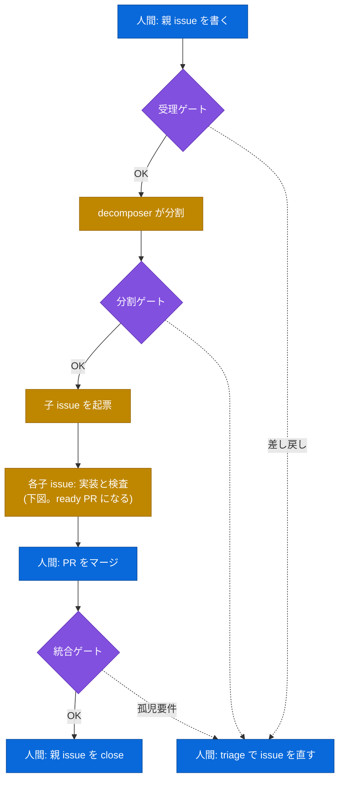
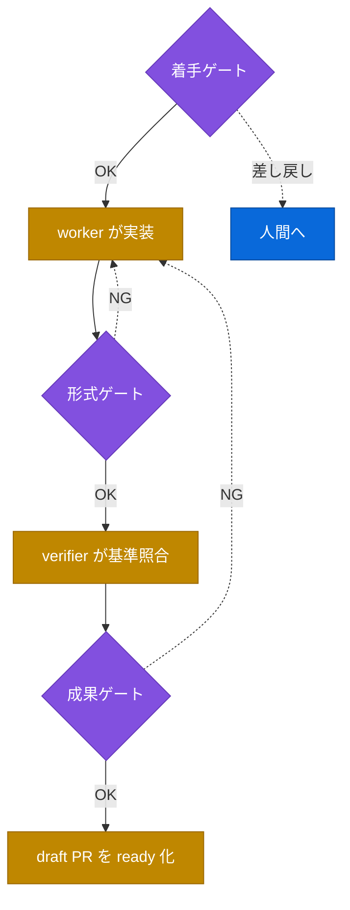

# tasuki(襷)

AI エージェント間の襷(タスクと契約)の受け渡しを中継所(ゲート)で検めながら、GitHub issue を自走で完走させる Claude Code plugin。

名前は駅伝に由来する。
区間をフェーズ、走者を agent、中継所をゲート、襷を契約、繰り上げスタートを打ち切り条件と読み替え、要件を具体化していく往路(降りるゲート)と、成果を報告へ束ねる復路(昇るゲート)をひとつのループとして走り切る。

## なぜゲートか

具体と抽象を往復する受け渡しでは、「この出力は、受け手が追加の解釈なしに受け取れる抽象度か」というズレがつなぎ目ごとに生じる。
抽象度に絶対の基準はなく、適切な粒度は受け手が誰か(次の分割役か、実装役か、人間か)で変わる。
人間がループの中にいれば都度直せるが、AI が実装からレビューまでを自律で回すループではそれができない。
そこで tasuki は、ズレの検知を仕組みとして各つなぎ目に埋め込む。
これがゲートであり、判定は絶対基準ではなく、受け手が契約で宣言した「待ち位置」との照合になる。
思想の全体は [docs/PHILOSOPHY.md](docs/PHILOSOPHY.md) にある。

## 何をするか

GitHub issue 駆動の自律ループ(実装と検証)の各フェーズのつなぎ目に抽象度ゲートを置き、出力を契約の待ち位置と照合して3値で判定する。

| 判定 | 意味 |
|---|---|
| `PASS` | 引き渡し位置が待ち位置と一致している |
| `TOO_ABSTRACT` | 曖昧すぎて、受け手が追加の解釈なしには受け取れない |
| `TOO_CONCRETE` | 詳しすぎて、受け手の判断余地を奪っている |

検証(実験)と開発の両方で使える汎用構成とし、まず Python を対象に実装している。

## ゲートの一覧

ゲートは名前で呼ぶ。
識別子(`intake` など)は GitHub のラベルや契約ファイルで機械が使うもので、名前をそのまま英語にしてある。

工程の順序としては、**受理から着手までが要件を具体へ降ろす関門、成果と統合が結果を報告へ束ねる関門**である。
形式ゲートだけは人が読まず、ツールが合否を出す。

| ゲート | いつ通るか | 何を見るか | 差し戻し先 | 識別子 |
|---|---|---|---|---|
| **受理ゲート** | 親 issue を書いた直後 | やりたいことが、分割できる粒度まで書けているか(背景、目的、価値、予算、完了の定義) | 起票者 | `intake` |
| **分割ゲート** | 親を子 issue へ割ったとき | 分割の集合として妥当か(依存が循環していないか、取りこぼした親要件がないか、予算に収まるか) | 分割役 | `split` |
| **着手ゲート** | 子 issue に着手する直前 | 実装役がそのまま着手できる粒度か(受け入れ条件と打ち切り条件があるか、実装方式を決めつけていないか) | 起票者または分割役 | `start` |
| **形式ゲート** | 実装のたび | lint、整形、型、テストが通るか(機械判定のみ。人の解釈を挟まない) | 実装役 | `checks` |
| **成果ゲート** | 実装が終わったとき | 報告が読める形か(要件と結果の対応表があるか、生ログを貼っていないか) | 実装役 | `outcome` |
| **統合ゲート** | 全子 issue のマージ後 | 親の完了の定義を満たしたか(どの子にも拾われなかった要件が残っていないか) | 起票者 | `integration` |

ラベルは識別子から作られる(`gate:intake-passed`、`gate:start-returned` のように付く)。

**どのゲートも「良し悪し」ではなく「抽象度のズレ」だけを見る。**
コードの良否は形式ゲート(機械判定)と人間のレビューが受け持ち、ゲートは受け渡しの位置だけを検める。

## 処理の流れ

人間が書くのは親 issue とマージだけで、あいだのレビューと実装はゲートと agent が回す。
差し戻しは triage として人間に返る。



各子 issue の内側は、着手ゲートから ready PR までを次の順に通る。
形式(形式ゲート)と成果(成果ゲート)の差し戻しは worker に戻り、着手(着手ゲート)の差し戻しだけが人間に返る。



## 誰がどのモデルで動くか

役割ごとに使うモデルを変えている。
**最上位モデルは判断に使い、量が出る作業は下位レートに流す**という配分で、根拠は「頻度 × 誤判定したときの下流コスト」である。

| 役割 | 何をするか | モデル |
|---|---|---|
| orchestrator | 計画、委譲、差し戻し管理。**コードは書かない** | 実行セッションのモデル(Fable 5 を推奨) |
| 受理 / 分割 / 統合ゲート | 親 issue 単位の低頻度な判定 | Opus |
| 成果ゲート | レポート照合。毎反復発生 | Sonnet(必要なら Opus へ昇格) |
| 着手ゲート | 子 issue ごとの高頻度な照合 | Haiku(必要なら Sonnet へ昇格) |
| decomposer | 親 issue を子へ分割 | Sonnet |
| worker | **実装を書く**。worktree 分離 | Sonnet |
| verifier | 成功基準と打ち切り条件の照合 | Sonnet |

**誤って通す(誤 PASS)ほうが、誤って差し戻す(誤 REJECT)より高くつく。**
誤 PASS はそのゲートより下流の作業をすべて無駄にするが、誤 REJECT は前工程を1回やり直すだけで済み、反復上限で有界である。
だから低頻度で下流コストの大きいゲートほど強いモデルを当てている。

ゲート判定のモデルは契約の `gates[].model` で、昇格先は `escalate_to` で変えられる。
worker と verifier と decomposer のモデルは agent 定義(`agents/*.md` の `model:`)で決まる。

## 前提

- git リポジトリと GitHub リモート
- `gh` CLI(sub-issues / issue dependencies を使うため v2.94.0 以上を推奨。未満は `gh api` フォールバック)
- Python プロジェクト(`pyproject.toml`)と `uv`
- CI は plugin が生成する(既存 CI は前提にしない)

## 導入

Claude Code に plugin として読み込む。
開発や試用は `--plugin-dir` で直接読む。

```bash
claude --plugin-dir /path/to/tasuki
```

常用する場合は `.claude-plugin/marketplace.json` を用意し、`/plugin marketplace add <パス>` で登録する。
読み込めたら `/plugin` の一覧に tasuki が出る。

## 使い方

1. plugin を導入し、対象リポジトリで `/tasuki:loop-init` を実行する。契約プロファイル、issue と PR のテンプレート、CI workflow、ラベルが生成される
2. やりたいことを **親 issue に1つ書く**(テンプレの必須欄=背景、目的、価値、予算、完了の定義を埋める)。子 issue は自分で書かない
3. `/tasuki:loop <親 issue 番号>` を実行する。**ループがまず issue をレビューする**:受理ゲートで親が書けているかを見て、分割ゲートで子への割り方を見て、着手ゲートで子1件ずつが実装できる粒度かを見る。通ったものだけ実装に進む。issue が曖昧なら triage で差し戻すので、指摘に沿って issue を直して再実行する
4. `/tasuki:loop-status <親番号>` で進行状況と裁定待ち(triage)を確認する。親 issue を指定すると、子ごとの一覧表で全体を俯瞰できる(依存に分岐や合流があるときは mermaid の図も添う)
5. **マージは常に人間が実行する**。ゲートが行うのはレビューまでで、最終判断は人間に残る

レビューは loop の中で gate が行い、ダメなときだけ triage であなたに返る。
issue を書く前に別途レビューさせる工程は要らない。

補足(任意だが推奨):ゲートのレビュアーは契約の「待ち位置」という自然言語で判定するため、最初は人間の感覚とズレる。
「この issue は PASS のはず」「これは差し戻しのはず」という判定例を数件書いて目盛りを合わせると、初回から判定が安定する。
手順は `tasuki:baton-contract` skill が案内する。

## 安全に使える範囲

v1 は issue、PR、コメントの内容を信頼できるリポジトリ専用である(maintainer が issue を書く前提)。
外部からの issue を受け付けるリポジトリでは、未検証テキストが agent に流れるため使わない。
詳細と v2 のハードニングは [docs/SECURITY.md](docs/SECURITY.md) にある。

## ドキュメント

設計文書は [docs/](docs/README.md) にまとまっており、読む順序と索引は [docs/README.md](docs/README.md) が案内する。
実装の到達状況(段階導入と E2E 結果)は [docs/ROADMAP.md](docs/ROADMAP.md) にある。

## License

[MIT](LICENSE)
