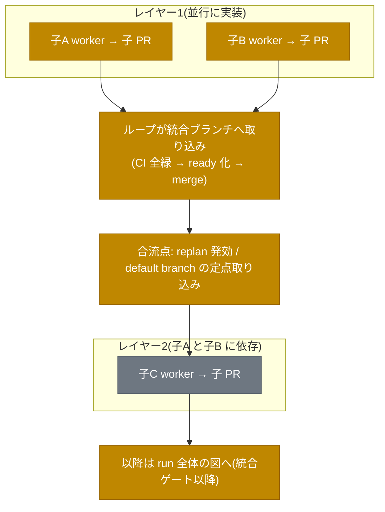
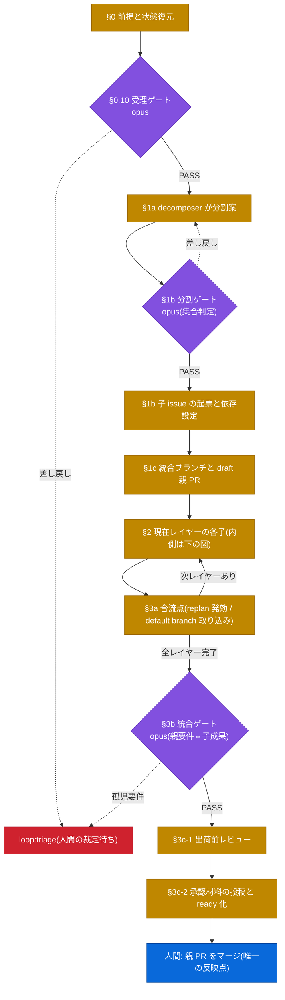
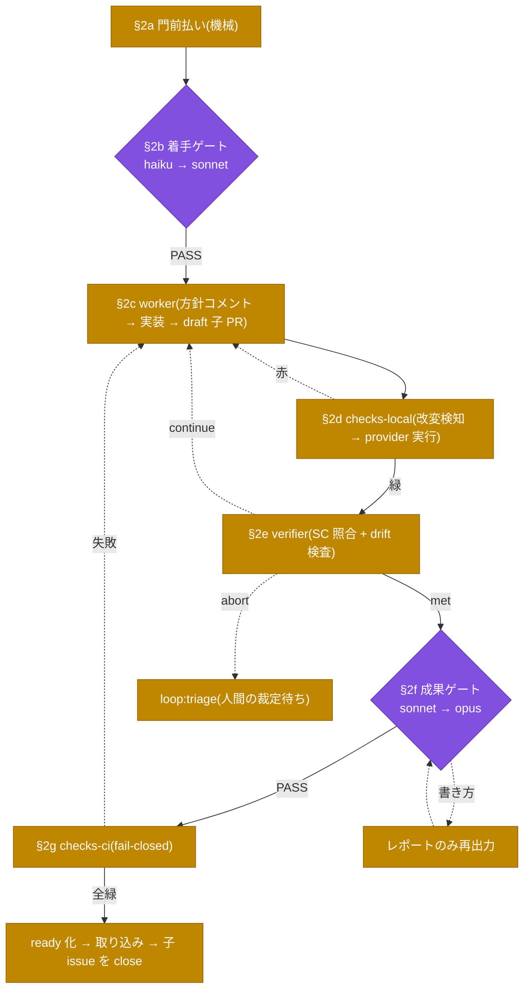
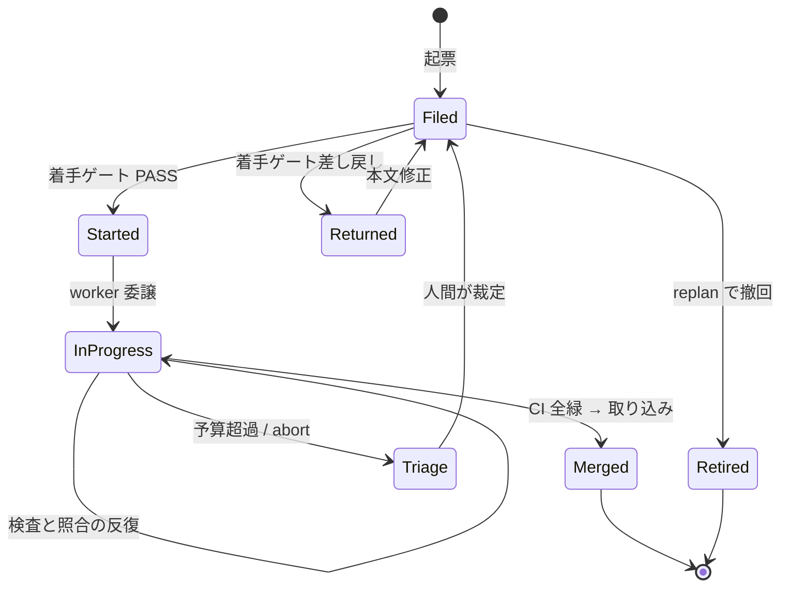

# アーキテクチャとロール

設計判断の由来は [PHILOSOPHY.md](PHILOSOPHY.md)、個々のゲートの仕様は [GATES.md](GATES.md) を参照。

## 三層構造

言語に固有な情報は language pack の中にのみ現れる。
2言語目は pack を1枚追加するだけで対応する。

```
core(言語非依存)
├── ゲート分類・verdict スキーマ・契約スキーマ
├── orchestrator ロジック(レイヤー実行・差し戻し管理・エスカレーション)
├── 質問ルーティング
├── findings 判定器(SARIF / JUnit XML を読む)
└── テンプレ生成器(契約 → issue テンプレ / CI workflow)

language pack(v1: python)
├── providers.yaml(lint / format / typecheck / test / security のコマンド定義)
├── 言語検出条件(pyproject.toml の存在)
└── normalizer(SARIF 非対応ツールの出力変換)

repo override(プロジェクト固有)
└── 上書き(コマンド、閾値、待ち位置定義、reviewer / criteria_skills、enabled_gates)と、必須欄の追加
```

core の findings 判定器は SARIF / JUnit XML を正とし、ツール固有の出力形式は pack の normalizer が吸収する。
どちらも出せない provider(整形チェックの exit-code、外部 Action の PR コメント)は、CI の job 成否のみで判定する。
判定器が個々のツールを知らないこの構造が、言語非依存を成立させる要である。

## plugin ディレクトリ構成

```
tasuki/
├── .claude-plugin/plugin.json    # name: tasuki
├── skills/
│   ├── gate-review/SKILL.md      # ゲート判定手順(3値判定・差し戻し文の書式)
│   ├── baton-contract/SKILL.md   # 契約(待ち位置)の書き方・読み方
│   ├── loop-report/SKILL.md      # レポート作成手順(対応表必須)
│   ├── plan-comment/SKILL.md     # 親 issue の計画コメント(図を描く条件を含む)
│   ├── mermaid/SKILL.md          # 図種の決定手順と記法(汎用。tasuki 固有の判断は持たない)
│   └── data-boundary/SKILL.md    # 入力を未検証データとして扱う共通規範(全 agent が参照)
├── agents/
│   ├── decomposer.md
│   ├── gate-reviewer.md          # 全ゲート共通。モデルは呼び出しごとに指定。読み取り専用
│   ├── worker.md                 # isolation: worktree
│   └── verifier.md
├── commands/
│   ├── draft.md                  # 親 issue の対話式起票支援
│   ├── loop-init.md              # ブートストラップ
│   ├── loop.md                   # ループ起動(親 issue 指定)。実行セッション= orchestrator
│   └── loop-status.md            # 進行状況・メトリクス表示
├── packs/
│   └── python/
│       ├── providers.yaml
│       └── normalizers/
└── profiles/
    └── tasuki.yaml
```

orchestrator は agent としては存在しない。
orchestrator は `/tasuki:loop` を実行するメインセッションが務める。
subagent もメインセッションの3階層下まで別の subagent を起動できるが(`CLAUDE_CODE_MAX_SUBAGENT_SPAWN_DEPTH` はその上限を下げる設定である)、orchestrator を subagent に置くと、人間への報告と裁定の要求が要約1回に畳まれてしまう。
**人間と直接やり取りする実行主体だから**メインセッションに置いている(ネストの可否は理由ではない)。
ゲート別モデル(後述のレイヤードレート構造)は、**gate-reviewer を1つの agent とし、起動ごとに `model` を指定して**実現する(Agent の起動引数の `model` は agent 定義の `model` より優先される)。

命名規約として、plugin 側の agent は `name:` フィールドに `tasuki-` 接頭辞を付けて名前空間を切る(衝突判定の対象はファイル名ではなく `name:`)。
コマンドは plugin 名で自動的に名前空間化される(`/tasuki:loop-init`)。

## 導入先プロジェクトの subagent との連携

orchestrator はメインセッションなので、導入先リポジトリの `.claude/agents/` にある subagent をそのまま呼べる。
契約の `gates[].reviewer` にプロジェクト agent 名を指定すれば、ゲート判定はその agent に委譲される(入出力契約は verdict JSON のまま)。
worker などの plugin agent からプロジェクト subagent を呼ぶことは、既定のネスト上限(メインセッションの3階層下まで)の範囲でできる。
tasuki の階層は orchestrator(メイン)→ worker → プロジェクト agent の3層に収まる。
導入先が `CLAUDE_CODE_MAX_SUBAGENT_SPAWN_DEPTH` を `1` にしている場合はネストが無効になり、worker は委譲せず自分で作業する。
tasuki の agent 同士のネスト(worker が verifier を呼ぶ等)は行わない。ループの構造は orchestrator だけが管理する。

## 状態管理

ループの状態はすべて GitHub 上に置き、plugin はローカル状態ファイルを持たない。

| 状態 | 置き場所 |
|---|---|
| タスクの親子関係 | sub-issues |
| 着手順 | issue dependencies |
| ゲート判定と差し戻し理由 | issue コメント(監査ログを兼ねる) |
| ゲート通過状況 | ラベル(`gate:start-passed` 等) |
| 成果物 | ブランチと PR |
| 判断原則の変更履歴 | 契約ファイルへの PR |

状態が GitHub に外部化されているため、クラッシュや中断のあともラベルと issue コメントから復元して途中再開できる(冪等性の要件はレビュー観点「冪等性、再開可能性」)。

## ロール定義

| ロール | 責務 | コンテキスト | 対応ゲート |
|---|---|---|---|
| orchestrator | 依存グラフ構築、レイヤー実行、差し戻し回数管理、エスカレーション。**コードを書かない** | 全体(ただし要約のみ保持) | 全ゲートの呼び出し元 |
| decomposer | 親 issue →子 issue の分割案作成 | 親 issue のみ | 分割ゲートの被検査者 |
| gate-reviewer | 契約照合、3値判定、質問の型付け。読み取り専用ツールのみ | 前工程出力+契約のみ(作業コンテキスト非共有) | 受理から統合までの全ゲート |
| worker | worktree 作成→実装/実験→ self-verify → PR 作成→報告→掃除。worker : worktree = 1 : 1 | 担当子 issue のみ | 形式ゲートの被検査者 |
| verifier | 成功基準と打ち切り条件の判定(maker と別コンテキスト) | 実行結果+ PR ブランチ名+子 issue の要件(統合の子では親 issue 本文も) | 内側ループの出口 |
| 人間 | 最終マージ、axis-question の承認、エスカレーション受け | — | 最終ゲート |

gate-reviewer が maker の作業コンテキストを共有しない点は要件である。
共有すると maker/checker 分離が崩れ、maker の思い込みを checker が引き継ぐ。

## Lead-Worker 型の実行構造

orchestrator が依存グラフからレイヤーを作り、レイヤー内は worker 並列、レイヤー間は直列で実行する。
レイヤー内の子 issue は並行処理し、ゲート判定と issue への書き込みは orchestrator が直列で行う(観点「並行整合性」)。
依存の循環はエラーとして検出し、報告して停止する。

次レイヤーへの前進は、前レイヤーの全子が**統合ブランチ**へ取り込まれてからとする。
合流点は統合ブランチの更新であり、人間のマージを待たない。
**人間がマージするのは親 PR(統合ブランチ → default branch)の1回だけ**であり、default branch への反映は常に人間の手を経る。
合流点([commands/loop.md](../commands/loop.md) の §3a(レイヤーの合流))は同時に、再計画(loop:replan)の発効点と、default branch の定点取り込み(hotfix の合流)でもある。
deploy と release の分離(feature flag)により、未完成の機能を理由にレイヤー実行を止めない。



灰色は未着手のレイヤーである。

## ループ詳細フロー

`/tasuki:loop` の1 run が通る経路である(手順の正は [commands/loop.md](../commands/loop.md)。この図は § 番号への地図)。
外側(run 全体)と内側(子1件)を2枚に分ける。



内側(子 issue 1件が通る経路)は次のとおり。



## 子 issue の状態遷移

状態はすべて GitHub のラベルと open / closed で表現される(ローカル状態なし)。



## レイヤードレート構造(モデル選択)

原則は、**最上位モデルは判断に限定し、トークンの物量は worker レートで流す** ことにある。
判断(計画と委譲、ゲートの裁定)に上位モデルを当て、実装と照合は Sonnet に流すことで、消費トークンの大半を worker レートで課金させる。
個々のゲートのモデルは「頻度 × 誤判定の下流コスト」で決める。
誤 PASS はゲートより下流をすべて無駄にするが、誤 REJECT は前フェーズ1回の再実行で済み `max_iterations` で有界という非対称性がある。

実装(worker)を上位モデルにするかは、この配分の主要な選択肢である。
実装が弱いと差し戻しのたびに実装と検査が再実行されるため、反復が増えるなら上位モデルのほうが安くなりうる。
v1 では **worker を Sonnet に置き、コストの支配項を worker レートに留める** 方を採る。
実運用のメトリクス(差し戻し回数とモデル別判定回数)で反復が多いと分かった場合に、この配分を見直す。

| 層 | ロール | モデル | 根拠 |
|---|---|---|---|
| 統括 | orchestrator | Fable 5 | 極少トークン、最高判断。計画、依存グラフ、委譲、エスカレーション裁定のみ。**ゲート判定は兼ねない**(maker/checker 分離とレート戦略の両方が崩れるため) |
| 高レバレッジ判定 | 受理 / 分割 / 統合ゲートの reviewer | Opus | 親 issue あたり1回程度の低頻度。誤 PASS の下流コスト最大 |
| 中頻度判定 | 成果ゲートの reviewer | Sonnet(Opus へ昇格可) | 意味検証だが毎反復発生 |
| 高頻度照合 | 着手ゲートの reviewer | Haiku(Sonnet へ昇格可) | チェックリスト照合。門前払いが機械処理済 |
| 物量 | worker / verifier / decomposer | Sonnet | トークンの大半。worker レート課金の主戦場 |
| 出荷前レビュー | 5観点レビューの subagent | Sonnet | 所見の採否は orchestrator が判断するため上位モデル不要。規模は契約の preship_review で制御 |

実装上、reviewer は `tasuki-gate-reviewer` の1つであり、モデルは orchestrator が起動ごとに指定する。
昇格は同じ agent を上位モデルで呼び直すことであり、agent を切り替えることではない。
ゲート別の判定基準は `tasuki:gate-review` skill の「ゲート別の特記事項」が単一の正である。
orchestrator のモデルはメインセッションのモデルそのものであり、plugin からは強制できない(`/tasuki:loop` の実行時に Fable 5 を選ぶことを推奨とする)。

### エスカレーション規則(非対称ルール)

1. verdict に `confidence: high | low` を必須化する。**low の PASS は破棄して `escalate_to` の上位モデルで再判定** する。low の REJECT はそのまま差し戻してよい(誤 REJECT は安いため)。`escalate_to` を持たないゲート(標準が opus の受理 / 分割 / 統合)は昇格先が無いため、下位モデルへ降格せず規則3の orchestrator 裁定へ回す
2. 同一ゲートで差し戻しが2回連続した場合も上位モデルへ昇格する(小型モデルの判定基準自体のズレを検出)
3. エスカレーション連鎖の終点は `haiku → sonnet → opus → Fable 裁定 → 人間`。差し戻し上限超過時、Fable が状況を要約し「契約の不備 / タスクの筋の悪さ / モデル能力の限界」を切り分けてから triage inbox に渡す(人間の判断コスト削減)

v1 はモデルを静的に固定し、v2 で bandit(Thompson Sampling 等によるタスク複雑度ベースの動的選択)を予約する。
回帰 fixture([OPERATIONS.md](OPERATIONS.md))に判定モデルを記録しておくことで、人間の正解ラベルがそのまま bandit の報酬データになる。
