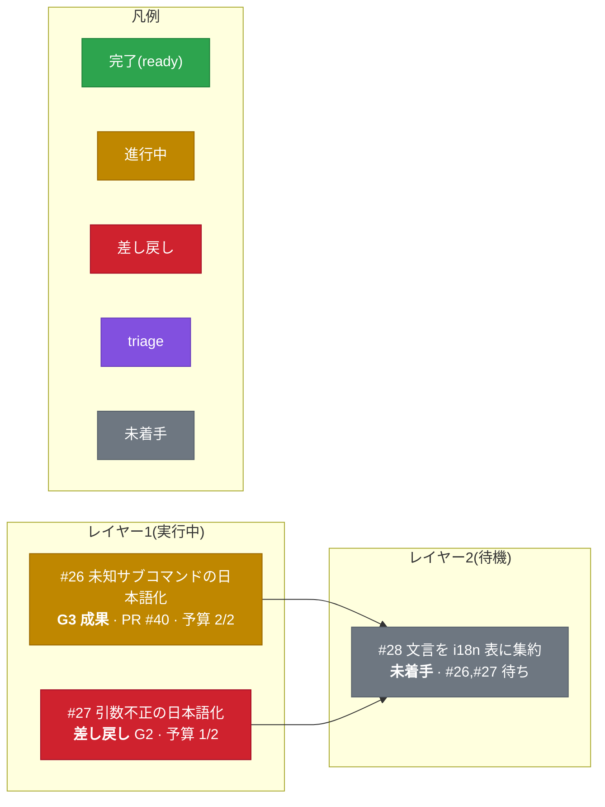
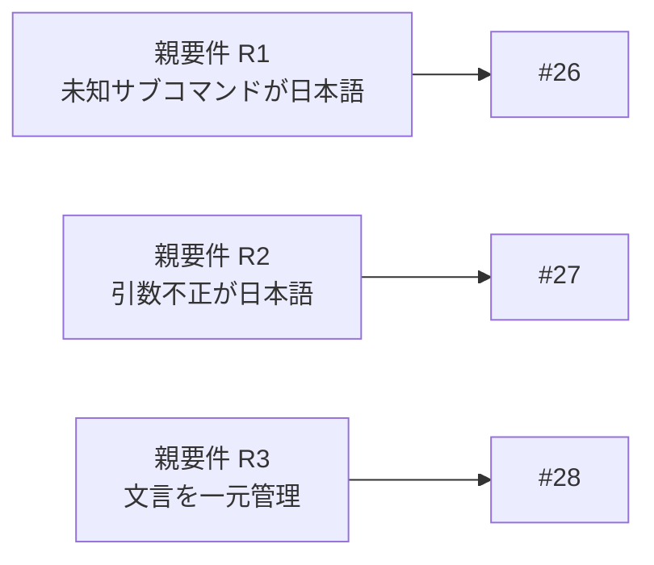
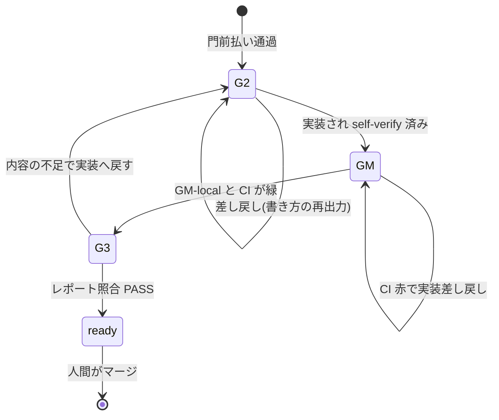

# 実装計画と進行の可視化(mermaid)

人間が親 issue を作ったあと、ループが分割した実装計画と進捗を mermaid で見せる。
目的は、人間が**全体設計(どの親要件がどの子でカバーされるか)と進捗(各子がどのゲートにいるか)を一目で管理できる**ことである。
図だけで足りない情報(リンク、verdict の要点)は、図の下のダッシュボード表で補う。

## 図種の選び方

用途で型を選ぶ。

| 見せたいもの | 型 | 理由 |
|---|---|---|
| 実装計画(子 issue の分割、依存、レイヤー、ゲート状況) | `flowchart LR` | 依存の合流(fan-in)、レイヤーの grouping、状態色を1枚で同時に出せる |
| 親要件のカバレッジ(どの親要件がどの子に対応するか、孤児の有無) | `flowchart LR`(要件→子の対応) | 設計の穴(孤児要件)が一目で分かる |
| 過程の説明(1 issue がゲートを通る流れと差し戻し) | `stateDiagram-v2` | ゲート列は状態機械で、始点終点と差し戻しの戻り辺が自然 |

使わない型とその理由。

- `gantt`:各タスクに日付か期間が必須。tasuki は反復予算(max_iterations)で管理し時間を持たない
- `mindmap`:単一ルートの木で、fan-in を表せない。辺ラベルも状態色も無い
- `block-beta`:beta 型で、GitHub の描画は pin されたバージョン依存で不確実

## GitHub の制約(設計上の前提)

- classDef の状態色、ノード内の ` ` 改行と `<b>` 太字は描画される
- `click` とノード内リンクは strict security で無効化される。**issue と PR へのリンクは図の外のダッシュボード表に置く**
- 上限は maxEdges 500、maxTextSize 50000 文字。大きい分割は、完了レイヤーを1ノードに畳むか、レイヤー帯ごとに分割投稿する
- 構文エラーは図全体がエラー表示になる。貼る前に構文を確認する

## エスケープ(壊さないための規則)

- ノードのラベルは必ずダブルクォートで囲む(`#`、`/`、`()`、` ` を含むため)
- 複数行は ` `、強調は `<b>...</b>` を使う(改行に `\n` は使わない)
- 日本語はそのまま使えるが、ASCII の記号を含む行はクォートで囲む
- `end` をノード ID にしない(subgraph を閉じる予約語)

## 計画コメントの構成(この順で1コメントにまとめる)

親 issue の「レイヤー計画」コメントは、次の4つを含める。
進行に応じて**同じコメントを編集して更新する**(新しいコメントを増やさない)。

### 1. 進捗サマリ(1行)

例:`計画: 子 3件 / ready 1 / 進行中 1 / 差し戻し 1 · 現在レイヤー L1`

### 2. 計画図(flowchart、情報量を持たせる)

各ノードに issue 番号、短いタイトル、現在のゲート状況、PR、予算(消費/上限)を載せる。
状態は `gate:*` / `loop:*` ラベルと PR の状態から決める。

| 状態 | 判定 | class |
|---|---|---|
| 完了 | PR が ready | `done` |
| 進行中 | `loop:in-progress` または `gate:g2-passed` 以降で未 ready | `inprogress` |
| 差し戻し中 | `gate:*-returned` | `returned` |
| 裁定待ち | `loop:triage` | `triage` |
| 未着手 | 依存待ち、または未処理 | `pending` |

### 3. 要件カバレッジ図(flowchart、孤児要件を見せる)

親 issue の各要件と、それをカバーする子を対応づける。
どの子にも対応しない親要件(孤児)があれば、対応先の無いノードとして一目で分かる。

### 4. ダッシュボード表(リンクはここに置く)

図に入れられない issue と PR のリンク、verdict の要点を表にする。

| 子 | 対応親要件 | ゲート状況 | PR | 予算 |
|---|---|---|---|---|
| #26 未知サブコマンド | R1 | G3 照合中 | #40 (draft) | 2/2 |
| #27 引数不正 | R2 | G2 差し戻し(打ち切り条件が曖昧) | — | 1/2 |
| #28 文言集約 | R3 | 未着手(#26,#27 待ち) | — | 0/2 |

## 過程図(stateDiagram-v2、任意の説明用)

1つの子 issue がゲートを通る流れの説明。
計画とは別に、運用を理解するための静的な図として1回貼れば足りる。

G0 / G1 / G4 を含むフルループでは、親側の受理と分割と統合を別の stateDiagram で説明してもよい。
