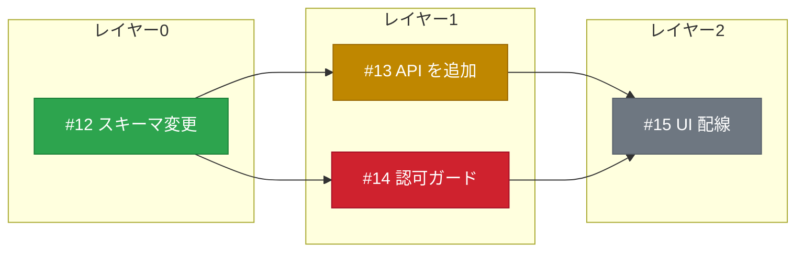
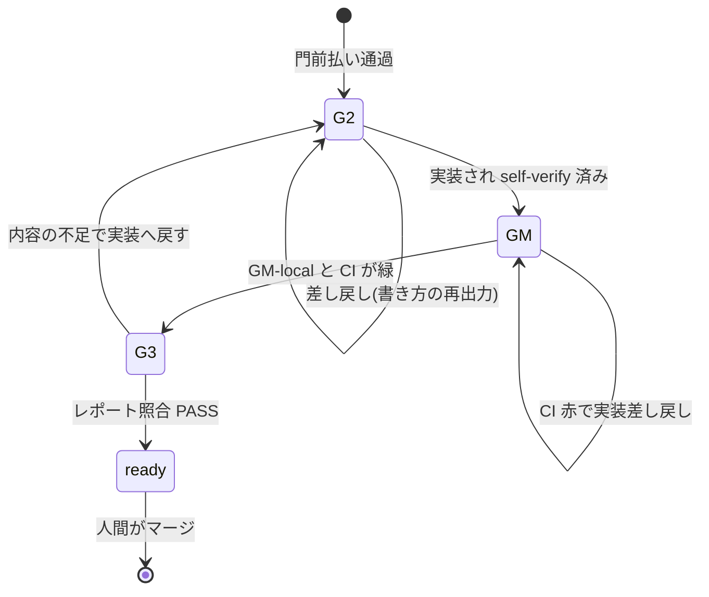

# 実装計画と進行の可視化(mermaid)

人間が親 issue を作ったあと、ループが分割した実装計画と、各 issue がゲートを通る流れを mermaid で見せる。
図は GitHub の issue コメントに ```` ```mermaid ```` フェンスで貼る(GitHub がネイティブに描画する)。

## 図種の選び方

用途で型を選ぶ。
迷ったらこの表に従う。

| 見せたいもの | 型 | 理由 |
|---|---|---|
| 実装計画(子 issue の分割、依存、レイヤー、状態) | `flowchart LR` | 依存の合流(fan-in)、レイヤーの grouping、状態色を1枚で同時に出せる |
| 過程の説明(1 issue がゲートを通る流れと差し戻し) | `stateDiagram-v2` | ゲート列は状態機械そのもので、始点・終点と差し戻しの戻り辺が自然に書ける |
| レイヤーの並びだけの軽い一覧 | `timeline`(任意) | 依存の辺や状態色は出せないが、段の並びを一目で見せられる |

使わない型とその理由。

- `gantt`:各タスクに日付か期間が必須。tasuki は反復予算(max_iterations)で管理し時間を持たないため、日付を捏造することになる
- `mindmap`:単一ルートの木で、2つの兄弟に依存する子(fan-in)を表せない。辺ラベルも状態色も無い
- `block-beta`:beta 型で、GitHub の描画は pin されたバージョン依存で不確実

## GitHub の制約(設計上の前提)

- classDef と class による状態色は描画される
- `click` とノード内リンクは strict security で無効化される。**issue へのリンクは図の外の markdown に置く**(図はラベルに issue 番号を書くだけにする)
- 上限は maxEdges 500、maxTextSize 50000 文字。大きい分割は、完了レイヤーを1ノードに畳むか、レイヤー帯ごとに分割して投稿する
- 構文エラーは図全体がエラー表示になる。貼る前に構文を確認する

## エスケープ(壊さないための規則)

- ノードのラベルは必ずダブルクォートで囲む(`#`、`/`、`()` を含むため)。例:`I13["#13 API を追加"]`
- 日本語はそのまま使えるが、ASCII の記号を含む場合はクォートする
- `end` をノード ID にしない(subgraph を閉じる予約語)
- クォートしても `#` が壊れる場合は `#35;` に置き換える

## 計画図(flowchart)

親 issue の分割が決まったら(G1 PASS 後、または人間起票の子が揃ったら)、依存グラフとレイヤーを flowchart で描く。

手順。

1. 子 issue を `blocked_by` の依存でレイヤー(L0、L1、…)に分ける(loop.md の §1c と同じ区分)
2. レイヤーごとに `subgraph` にまとめ、`blocker --> blocked` の辺を引く
3. 各子の状態を `gate:*` / `loop:*` ラベルから決め、`classDef` の色を当てる

状態とラベルの対応。

| 状態 | 判定 | class |
|---|---|---|
| 完了(ready 化) | PR が ready | `done` |
| 進行中 | `loop:in-progress` または `gate:g2-passed` 以降 | `inprogress` |
| 差し戻し中 | `gate:*-returned` | `returned` |
| 裁定待ち | `loop:triage` | `triage` |
| 未着手(依存待ち) | 上記いずれでもない | `pending` |

テンプレート(コマンド部分の値は実データで埋める)。



凡例は小さな独立 subgraph として、状態色つきのノードを並べて添える。
PR へのリンクや各 issue の verdict は、図の下の markdown に箇条書きで置く(図の中に入れない)。

## 過程図(stateDiagram-v2)

1つの子 issue がゲートを通る流れの説明。
計画とは別に、運用を理解するための静的な図として1回貼れば足りる(進行のたびに更新しない)。



有効なゲートは契約の `enabled_gates` で変わる。
G0 / G1 / G4 を含むフルループでは、親 issue 側の受理と分割と統合を別の stateDiagram で説明してもよい(親の流れと子の流れを分ける)。

## 更新の冪等性

計画図は親 issue の「レイヤー計画」コメントに含め、進行に応じて**同じコメントを編集して更新する**(新しいコメントを毎回増やさない)。
状態色だけを差し替えれば、人間はいつでも最新の俯瞰を1コメントで見られる。
